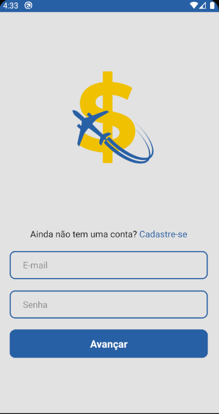

# PrevGO Projeto

## :notebook: Descrição

Em um mundo onde os jovens se interessam cada vez menos por assuntos financeiros ou possuem a imagem de previdência privada como algo pouco atrativo, criamos o **PrevGo**. O **PrevGo** é um aplicativo desenvolvido para a geração Z com o intuito de mostrar de forma interativa e educativa as vantagens de se pensar a longo prazo. Como em um jogo, os usuários vão conquistando novos países e aumentando a posição no ranking conforme investem mensalmente. Tal funcionalidade irá gerar uma maior constância de investimentos por parte do usuário além de o educar para o mercado financeiro por meio de conteúdos exclusivos, gerando uma maior receita de valor.

## :iphone: Instalando o app

Nosso time deixou uma APK pronta para testes! Só precisa baixar o arquivo `prevgo.apk`, contido na pasta do projeto.

Lembre-se de habilitar a opção _"Permitir download de fontes desconhecidas"_ no seu smartphone.

### Vamos abarcar nessa aventura juntos?
